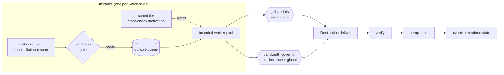
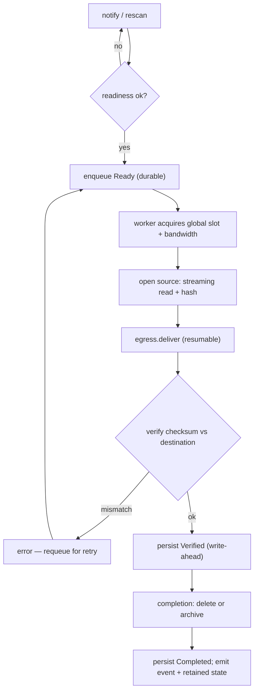
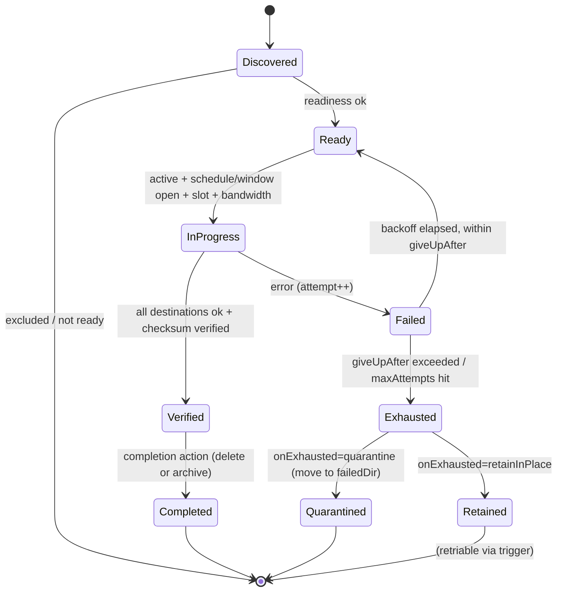
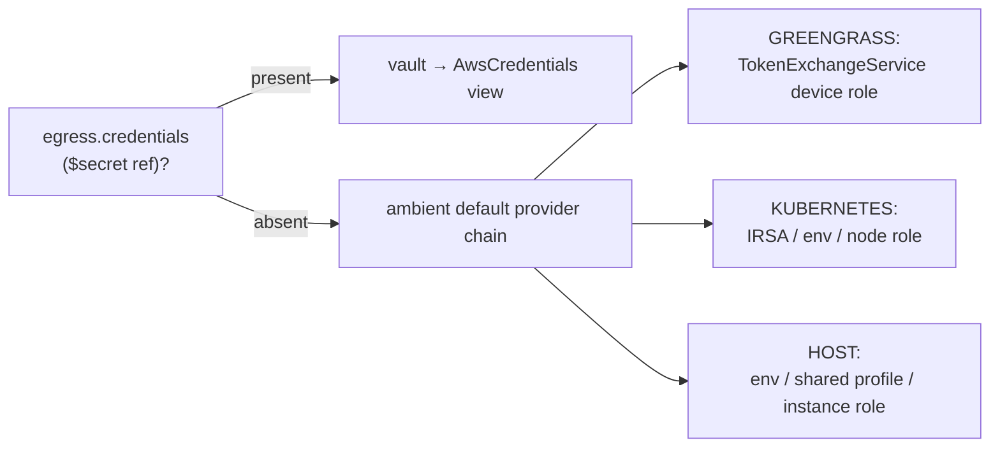
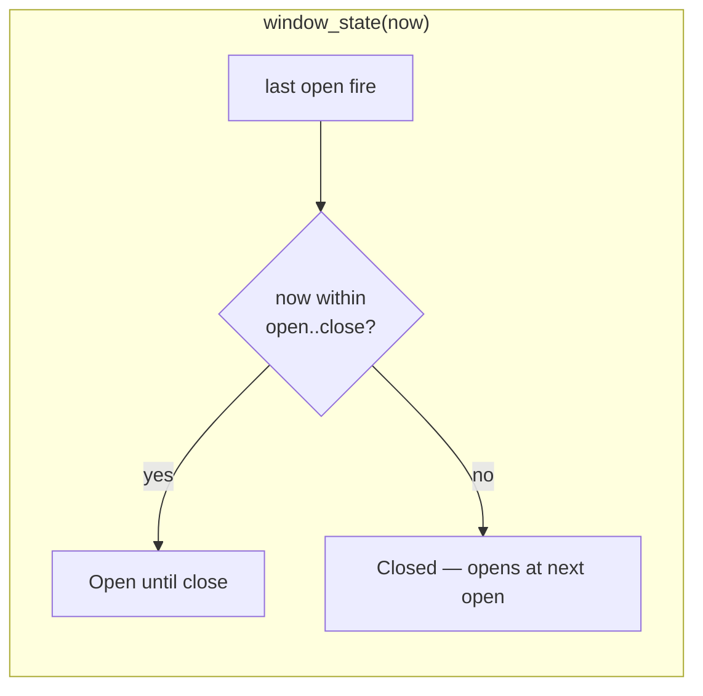
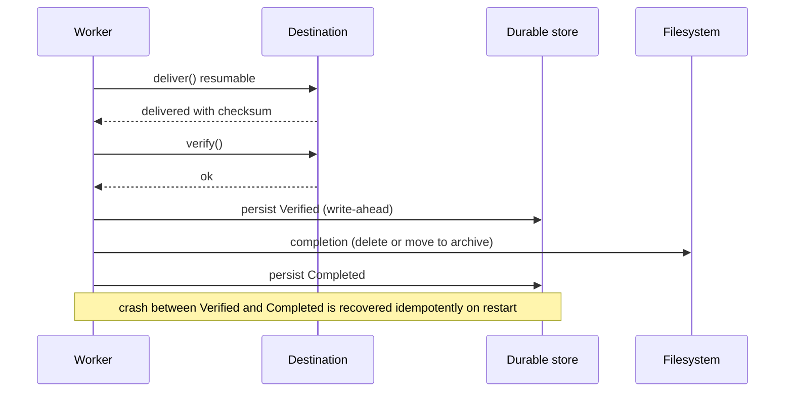
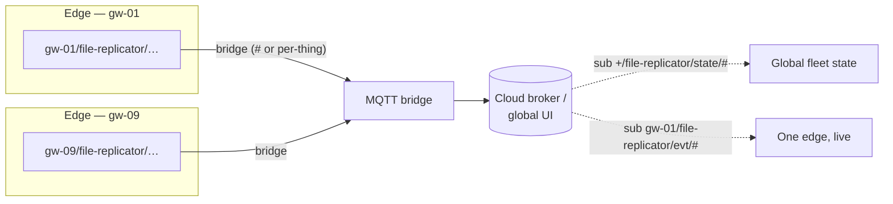

# file-replicator — Requirements & Design

> **Status:** DRAFT for review · **Version:** 0.2 (revised after review round 1) · **Date:** 2026-07-01
> **Component:** `file-replicator` · **Full name:** `com.mbreissi.greengrass.FileReplicator`
> **Category:** `sink` (northbound delivery) · **Language:** Rust · **Library:** `ggcommons`
> **Platforms:** HOST · GREENGRASS · KUBERNETES

This document is the single review artifact. It captures **what** the component does (requirements) and
**how** it is built (design), grounded in EdgeCommons conventions (`telemetry-processor` as the Rust
template, the `ggcommons` library API, and the org registry/CI/docs plumbing). Nothing is implemented yet —
this is for review before scaffolding.

### Changes since v0.1 (review round 1)

| # | Your feedback | Where addressed |
|---|---|---|
| 1 | FR-SCH-5: configurable window-close behavior (finish-in-flight vs pause/resume, with fallback) | §12.4, FR-SCH-5 |
| 2 | Bandwidth/network-utilization cap knob | §13.5, FR-REL-6, config §7 |
| 3 | Instance activate/deactivate, persisted, control-plane message | §7.5, §14, §16, FR-CTL-4/5, FR-STATE |
| 4 | Events for activate/deactivate + more | §17.1, FR-EVT |
| 5 | S3 credentials: ambient by default, optional override | §11.5, FR-EGR-7 |
| 6 | Mermaid diagrams instead of ASCII | throughout (§6, §8, §13) |
| 7 | S3: Transfer Acceleration, trailing checksums, unsigned PUT, prefix parallelism | §11.2–§11.4 |
| 8 | Cron vs custom grammar; expose cron; windows-on-cron | §12 (rewritten) |
| 9 | Separate "Failed" folder for retry-exhausted files | §13.3, FR-CMP-6, config §7 |
| 10 | Retry behavior across multi-hour / ~2-day disconnects | §13.4 |
| 11 | redb vs SQLite — revisit now C compiler is resolved | §14 (now recommends SQLite) |
| 12 | Unified, RESTful, cloud-bridge-safe topic namespace | §15 (new), §16, §17 |
| 13 | Docs: extensive samples + deep explanation, not syntax rehash | §19 |
| 14 | Decisions C/E/G accepted; F pending SQLite eval | §20 |

---

## Table of contents

1. [Overview & positioning](#1-overview--positioning)
2. [Language decision (Rust)](#2-language-decision-rust)
3. [Concepts & terminology](#3-concepts--terminology)
4. [Functional requirements](#4-functional-requirements)
5. [Non-functional requirements](#5-non-functional-requirements)
6. [Architecture](#6-architecture)
7. [Configuration model](#7-configuration-model)
8. [The replication engine](#8-the-replication-engine)
9. [Readiness detection](#9-readiness-detection)
10. [Destinations](#10-destinations)
11. [S3 destination — high-performance design](#11-s3-destination--high-performance-design)
12. [Scheduling & windows](#12-scheduling--windows)
13. [Completion, integrity & reliability](#13-completion-integrity--reliability)
14. [Durable state](#14-durable-state)
15. [Unified namespace (topic design)](#15-unified-namespace-topic-design)
16. [Control-message suite](#16-control-message-suite)
17. [Status/event publishing (realtime UI)](#17-statusevent-publishing-realtime-ui)
18. [Observability, platform & packaging](#18-observability-platform--packaging)
19. [Documentation strategy](#19-documentation-strategy)
20. [Open decisions & recommendations](#20-open-decisions--recommendations)
21. [Phased implementation plan](#21-phased-implementation-plan)
22. [Appendix — registry entry, deps, repo scaffold](#22-appendix--registry-entry-deps-repo-scaffold)

---

## 1. Overview & positioning

`file-replicator` watches one or more local source directories and **replicates files** (copy-then-remove,
i.e. "move") to one or more destinations — another local directory, S3, and a pluggable set of remote
backends — either **as files arrive** (default) or **on a schedule/window**. It handles on-complete source
lifecycle (delete / archive / quarantine-on-failure), retries with resumable partial uploads, throttles
bandwidth, can be activated/deactivated per instance from the control plane, exposes a full
**control-message** surface, and publishes **granular status events** on a unified, cloud-bridge-safe
namespace so a realtime UI (edge or global) can be built on top.

**Where it sits.** It is a **sink / northbound-delivery** component (`adapter | processor | sink`). The
registry already reserves the `sink` category and the org profile/docs have a "Sinks — northbound delivery"
section waiting for the first one. Its *data plane* is files on disk (not the MQTT bus); it speaks the
standard ggcommons *control plane* (message envelope, config schema, health, metrics, credentials vault).

**Design ethos.** Per the EdgeCommons "depth over simplest-case" principle, this covers the full capability
surface (arrays not scalars, multi-destination-ready, cron + windows, resumable uploads, bandwidth caps,
activation, a complete control+event surface on a proper UNS). Where that adds risk, we phase the
*implementation* (§21) without narrowing the *design*.

---

## 2. Language decision (Rust)

**Rust**, confirmed — the ecosystem-consistent choice (`telemetry-processor` is Rust) and a near-ideal fit:
resource-constrained edge (small static binary, low RSS, no GC), clean `tokio` concurrency for parallel
multipart uploads + per-instance isolation, precise streaming I/O with backpressure, and strong typing for
data-loss-sensitive move-then-delete logic. It reuses the `ggcommons` Rust lib directly (messaging, config,
credentials vault, health, metrics) with no FFI and one CI lane.

**Toolchain note (updated 2026-07-01):** the earlier "pure-Rust to avoid a C compiler on Windows" driver is
**no longer a hard constraint** — MSVC Build Tools are installed and on PATH, so C-vendoring crates
(bundled SQLite, mlua) build natively on Windows. This directly reopens the durable-state choice (§14). We
still prefer pure-Rust where it's a wash, but SQLite is now on the table.

Backend-SDK maturity (Azure/GCS younger in Rust) is contained behind the `Destination` trait (§10) and
cargo features so a build pulls only what it needs.

---

## 3. Concepts & terminology

| Term | Meaning |
|---|---|
| **Instance** | One watched-directory specification = one `component.instances[]` entry (the standard ggcommons instance idiom, as `telemetry-processor` uses routes). Unit of config, isolation, statistics, activation, and control. |
| **Ingress** | The source: local directory, optional recursion, readiness policy, include/exclude globs. |
| **Egress** | Destination(s): an ordered **list** of delivery targets. v1 enforces exactly one; schema + engine are multi-destination-ready (§20-B). |
| **Schedule** | *When* work runs: `immediate` (on arrival, default), `cron` (point trigger), or `window` (a recurring open→close span). |
| **Window** | A recurring time span (`open`→`close`, cron-defined) during which uploads are permitted; work outside waits for the next window. |
| **Completion** | Source-file lifecycle after **all** egress succeed: `delete` or `archive`; on retry-exhaustion, `quarantine` (Failed folder). |
| **Readiness** | Policy deciding a newly-seen file is fully written and safe to move (default: stability window). |
| **Activation** | Runtime on/off state of an instance, **persisted** across restarts, toggled via config or a control message. |
| **Work item** | A single file tracked through its lifecycle; persisted durably. |
| **UNS** | Unified Namespace — the single, RESTful, site-scoped, cloud-bridge-safe topic hierarchy for all cmd/evt/state (§15). |

---

## 4. Functional requirements

IDs follow the ecosystem `FR-<AREA>-<n>` convention. RFC-2119 keywords.

### 4.1 Ingress / watching (ING)

- **FR-ING-1** — MUST watch a configured local **source directory** for files.
- **FR-ING-2** — MUST support **non-recursive** (default) and **recursive** (whole tree) watching per instance.
- **FR-ING-3** — When recursive, MUST **preserve the relative subtree** at the destination and auto-create destination subdirs (local/SFTP) or encode as key prefix (object stores).
- **FR-ING-4** — MUST support **include/exclude glob patterns** against the source-relative path.
- **FR-ING-5** — MUST detect files that **already exist** at startup (pre-existing spool), not only new arrivals.
- **FR-ING-6** — MUST use OS notifications for low-latency detection **and** a periodic **reconciliation rescan** (network FS, event overflow, pre-start files).
- **FR-ING-7** — MUST decide **readiness** before queueing (§9); default = stability window.
- **FR-ING-8** — MUST NOT act on its own archive / failed / destination directories if they live under the watch root (loop prevention).

### 4.2 Egress / destinations (EGR)

- **FR-EGR-1** — Destination types: **local** + **S3** (v1); **SFTP/FTPS**, **HTTP(S)**, **Azure Blob**, **GCS** (designed, phased).
- **FR-EGR-2** — Egress is an **ordered list** per instance; **v1 validates exactly one**; multi-destination fan-out fully specified (§20-B).
- **FR-EGR-3** (multi, future) — File **Completed only when ALL destinations succeed**; each retries **independently**; completion fires once.
- **FR-EGR-4** — Configurable **path/prefix mapping** per destination; preserves the recursive subtree.
- **FR-EGR-5** — MUST report **per-file progress** (bytes / total) to drive events + statistics.
- **FR-EGR-6** — Destinations that support it MUST **resume a partial transfer** rather than restart (§13).
- **FR-EGR-7** — Cloud destinations MUST support **ambient credentials by default** (platform provider chain) with an **optional explicit `$secret` override** (§11.5).

### 4.3 Scheduling (SCH)

- **FR-SCH-1** — MUST support **immediate** mode (default).
- **FR-SCH-2** — MUST support **cron** schedules (standard cron via a maintained tz-aware crate) as the primary expression; MAY offer plain-English **sugar** for common cases (§12).
- **FR-SCH-3** — MUST support **windows** (`open`→`close`), incl. overnight; files ready outside the window **wait** for the next open.
- **FR-SCH-4** — MUST be **timezone + DST aware** per instance (default component-wide TZ; fallback UTC).
- **FR-SCH-5** — MUST offer a **configurable window-close behavior**: (a) **finish in-flight** transfers past close, or (b) **pause & resume** at the next window **if the destination supports resume** — otherwise **finish the current** transfer (never lose partial progress).
- **FR-SCH-6** — MUST publish schedule/window lifecycle events (§17).

### 4.4 Completion & lifecycle (CMP)

- **FR-CMP-1** — Two on-success behaviors: **delete** source, or **move to archive dir**.
- **FR-CMP-2** — Archive/quarantine MUST preserve the relative subtree; on name collision apply a configurable policy (default: suffix; never silently overwrite).
- **FR-CMP-3** — Completion action MUST fire **only after successful integrity verification** of **all** egress targets.
- **FR-CMP-4** — Completion MUST be **crash-safe** (no loss, no silent double-delivery; idempotent re-verify on restart; §14).
- **FR-CMP-5** — `completion` is a **separate instance section**, not part of `egress` (§20-C, accepted).
- **FR-CMP-6** — On retry-exhaustion, MUST support **quarantine to a Failed dir** (with an error sidecar) or **retain-in-place** (configurable; §13.3).

### 4.5 Reliability / retry / resume / limits (REL)

- **FR-REL-1** — On error, the file MUST **remain queued** and be retried (never dropped).
- **FR-REL-2** — Retries MUST use **bounded exponential backoff with jitter**; give-up governed by **time** (`giveUpAfter`) and/or an optional attempt cap (§13.4).
- **FR-REL-3** — Where supported, a retry MUST **resume from the last successful part/offset** (persisted; §14).
- **FR-REL-4** — MUST be **idempotent** on re-delivery (stable keys; verify-before-complete).
- **FR-REL-5** — MUST apply **concurrency backpressure**: bounded in-flight files per instance and globally.
- **FR-REL-6** — MUST support a **bandwidth cap** (bytes/sec) per instance **and** a global aggregate cap (§13.5).
- **FR-REL-7** — MUST **tolerate long disconnections** (hours to ~2 days): keep retrying within `giveUpAfter`, resume in-flight uploads, and avoid reconnect thundering-herd via a disconnection circuit-breaker (§13.4).

### 4.6 Activation & state (STATE)

- **FR-STATE-1** — Each instance has a runtime **active/inactive** state; default from config `enabled` (default `true`).
- **FR-STATE-2** — Activation state MUST be **persisted** and survive component restart; the **persisted runtime state wins** over config `enabled` (control plane is the live authority), with a documented reset path.
- **FR-STATE-3** — A **control message** MUST activate/deactivate an instance (optionally non-persistently).
- **FR-STATE-4** — Deactivate MUST stop discovery + admit no new transfers; queued items **remain** and resume on reactivation; in-flight transfers follow the same finish/pause policy as window-close (FR-SCH-5).

### 4.7 Configuration (CFG)

- **FR-CFG-1** — Config under `component.global` / `component.instances[]`; component parses its own subtree (no canonical-schema change).
- **FR-CFG-2** — `component.global.defaults` overlaid per instance (instance wins).
- **FR-CFG-3** — Tolerate **Greengrass numeric doubles** (lenient int-or-float) on all numeric fields.
- **FR-CFG-4** — A malformed instance is **logged and skipped**; startup fails only if **zero** instances build.
- **FR-CFG-5** — Resolve secrets via **`$secret` refs** so credentials never appear in the logged config.
- **FR-CFG-6** — Config hot-reload SHOULD apply per-instance changes without dropping in-flight transfers where possible (drain-and-restart the changed instance at minimum).

### 4.8 Control surface (CTL) — §16

- **FR-CTL-1** — Answer **get-config** (reuse core `GetConfiguration` contract; §16, §20-E).
- **FR-CTL-2** — Answer **get-status** with per-instance statistics (awaiting incl. names/sizes/ages, replicated, failed incl. last error, in-progress incl. **% complete**, schedule/window state, active state).
- **FR-CTL-3** — Accept **trigger** (force scan+replication now; per-instance or all; optional ignore-window).
- **FR-CTL-4** — Accept **set-activation** (activate/deactivate an instance; persistent by default).
- **FR-CTL-5** — All control replies use request/reply (`reply_to` / `messaging.reply`) on the UNS (§15).

### 4.9 Events (EVT) — §17

- **FR-EVT-1** — Publish lifecycle events on the UNS with intelligent defaults: file discovered/ready, upload started/progress(throttled)/completed/failed, file archived/deleted/quarantined, retries-exhausted, schedule-triggered, window-opened/closed, scan-complete, **instance-activated/deactivated**, component-ready.
- **FR-EVT-2** — Progress events MUST be **throttled** (percent delta and/or time).
- **FR-EVT-3** — Events MUST carry enough context (instance, relative path, size, bytes-done, destination, attempt) to drive a UI without extra lookups.
- **FR-EVT-4** — Current per-instance/component **state** MUST be published **retained** so a fresh subscriber (edge UI or cloud) gets the latest snapshot on connect (§15, §17). **Implementation status (P3): a KNOWN GAP.** The ggcommons Rust `MessagingService` exposes no MQTT retain flag today, so state is published **non-retained** (best-effort): live subscribers see every snapshot on each transition, but a subscriber that connects *after* the last snapshot will not receive it. The reliable current-state-on-demand path is the `cmd/status` request/reply, which works regardless. Closing the gap needs a one-line, four-language ggcommons enhancement (`publish_retained`) — see the module docs in `src/events.rs`. We do NOT fake retention (no periodic republish spam).

---

## 5. Non-functional requirements

- **NFR-1 (Platforms)** — HOST / GREENGRASS / KUBERNETES via the ggcommons resolver; no platform branching in engine code.
- **NFR-2 (Coverage)** — Org **90% line-coverage gate** (`cargo llvm-cov --fail-under-lines 90`); live-infra paths excluded via trait seams + fakes.
- **NFR-3 (Footprint)** — Idle RSS < 25 MiB; bounded memory under a 100k-file spool (streaming reads, state on disk).
- **NFR-4 (Throughput)** — Saturate uplink for large files (parallel multipart, acceleration); handle high-count small-file spools via bounded concurrency + prefix parallelism.
- **NFR-5 (Durability)** — No acknowledged-ready file lost across crash, reboot, window boundary, deactivation, or a ~2-day outage.
- **NFR-6 (Portability)** — Builds on Windows/Linux/WSL. C-toolchain now available on all dev targets (§2); a C-compile step is acceptable if it buys real value (§14).
- **NFR-7 (Security)** — Credentials via ambient chain or vault/`$secret`; TLS-by-default for network backends; least-privilege IAM guidance in docs.
- **NFR-8 (Observability)** — Metrics via `gg.metrics()`; health via library HTTP endpoints on k8s; structured JSON logs on k8s; retained UNS state.

---

## 6. Architecture

### 6.1 Runtime shape (mirrors `telemetry-processor`)

`main.rs` is ~40 lines — build the runtime, hand off to the app, await shutdown:

```rust
use ggcommons::prelude::*;
const COMPONENT_NAME: &str = "com.mbreissi.greengrass.FileReplicator";

#[tokio::main]
async fn main() -> anyhow::Result<()> {
    let gg = GgCommonsBuilder::new(COMPONENT_NAME).args(std::env::args_os()).build().await?;
    let app = app::ReplicatorApp::start(&gg).await?;
    app.run(&gg).await?;   // runs until gg.shutdown_signal()
    Ok(())
}
```

The library owns platform detection, config source, logging, metrics, heartbeat, health, SIGTERM, and
hot-reload. Teardown is RAII on `GgCommons` drop.

### 6.2 Module layout

```
src/
  main.rs            canonical bootstrap
  app.rs             ReplicatorApp: one Instance per component.instances[]; wires control + shutdown
  config.rs          serde config model + lenient numbers + validation
  instance/
    mod.rs           Instance runtime (watcher + scheduler + queue + workers + activation) for one dir
    watcher.rs       notify watcher + reconciliation rescan + readiness gate
    queue.rs         durable work-queue + state machine + backpressure + bandwidth governor
    worker.rs        per-file driver: read → egress → verify → complete
  schedule/
    mod.rs           Schedule/Window model; next-fire / window-state (cron via croner + chrono-tz)
    sugar.rs         optional plain-English → cron sugar
  dest/
    mod.rs           Destination trait + factory
    local.rs s3.rs sftp.rs http.rs azure.rs gcs.rs      (feature-gated)
  control.rs         control dispatcher (get-config / get-status / trigger / set-activation)
  events.rs          event + retained-state publisher (UNS topic builder + progress throttle)
  integrity.rs       streaming CRC32C / SHA-256 + verification
  state.rs           durable store (work items, resume checkpoints, activation, stats)
  ratelimit.rs       token-bucket bandwidth governor (per-instance + global)
  metricsx.rs        metric definitions + emission
```

### 6.3 Concurrency & governors



- **One `Instance` task per watched dir** — independent watcher/scheduler/queue/workers/stats/activation, so
  a slow or failed destination on one instance never stalls another.
- **Bounded worker pool per instance** + a **global** semaphore cap total in-flight (FR-REL-5).
- **Bandwidth governor**: token buckets, one per-instance and one global, throttle the transfer byte-stream
  (FR-REL-6, §13.5).
- **Scheduler** gates whether `Ready` work may start (immediate=always; cron/window per §12) and whether the
  instance is **active** (§7.5).
- Shutdown: `gg.shutdown_signal()` → stop new work, checkpoint resume state, drain/pause, flush, drop.

### 6.4 Data-flow (single file, immediate mode)



---

## 7. Configuration model

Config is one JSON document from the platform's source (FILE/CONFIGMAP/GG_CONFIG). The component owns
`component.*`; sibling sections (`messaging`, `credentials`, `logging`, `heartbeat`, `metricEmission`,
`health`, `tags`) are standard ggcommons sections.

### 7.1 Instance sections

`ingress` / `egress` / `schedule` / `completion` / `retry` / `limits`, plus `enabled` and an optional
`topics` override. Readiness lives under `ingress`; integrity + failed-folder under `completion`; bandwidth
under `limits`. `completion` is its own section (§20-C, accepted).

### 7.2 Annotated example — S3, immediate, archive-on-success, quarantine-on-fail

```jsonc
{
  "component": {
    "global": {
      "defaults": {
        "retry": { "baseDelayMs": 1000, "maxDelayMs": 900000, "giveUpAfter": "7d" },
        "timezone": "America/Chicago"
      },
      "limits": { "maxConcurrentFiles": 8, "maxBandwidth": "50MB/s" },   // aggregate caps
      "topics": { "prefix": "{ThingName}/file-replicator" }   // UNS root (defaulted; §15)
    },
    "instances": [
      {
        "id": "plant-csv-to-s3",
        "enabled": true,                         // initial activation (runtime state may override, §7.5)

        "ingress": {
          "path": "/data/outbound/csv",
          "recursive": true,
          "include": ["**/*.csv"],
          "exclude": ["**/*.tmp", "**/.*"],
          "rescanSecs": 30,
          "readiness": { "strategy": "stability", "quietSecs": 5 }   // stability|marker|rename|glob
        },

        "egress": [                              // LIST — v1 requires exactly one element
          {
            "type": "s3",
            "bucket": "acme-plant-telemetry",
            "prefix": "site42/csv/",
            "region": "us-east-1",
            // credentials OPTIONAL — omit to inherit the platform's ambient chain (§11.5)
            "storageClass": "INTELLIGENT_TIERING",
            "sse": "aws:kms",
            "accelerate": true,                  // S3 Transfer Acceleration endpoint
            "unsignedPayload": true,             // skip payload signing pass on simple PUTs (TLS)
            "checksumAlgorithm": "CRC32C",       // flexible/trailing checksum, single-pass
            "multipart": { "thresholdBytes": 16777216, "partSizeBytes": 16777216, "maxConcurrentParts": 4 }
          }
        ],

        "schedule": { "mode": "immediate" },

        "completion": {
          "onSuccess": "archive",                // archive | delete
          "archiveDir": "/data/processed/csv",
          "onExhausted": "quarantine",           // quarantine | retainInPlace
          "failedDir": "/data/failed/csv",
          "onCollision": "suffix",               // suffix | overwrite | fail
          "verify": "checksum"                   // checksum | size | none
        },

        "retry":  { "baseDelayMs": 1000, "maxDelayMs": 900000, "giveUpAfter": "7d", "maxAttempts": null },
        "limits": { "maxConcurrentFiles": 4, "maxBandwidth": "20MB/s" }
      }
    ]
  },

  "credentials": { "vault": { "path": "/data/vault.json" }, "keyProvider": { "type": "file" } },
  "messaging":   { /* platform-appropriate broker block */ },
  "tags":        { "enterprise": "acme", "site": "site42" },   // in the ENVELOPE for consumer-side filtering — NOT in the topic path (§15)
  "logging":     { "level": "INFO" },
  "metricEmission": { "namespace": "filereplicator" }
}
```

### 7.3 Annotated example — nightly window to a NAS, bandwidth-capped

```jsonc
{
  "id": "nightly-images-to-nas",
  "ingress": { "path": "/var/spool/images", "recursive": false,
               "readiness": { "strategy": "rename" } },
  "egress":  [ { "type": "local", "path": "/mnt/nas/ingest/images", "fsync": true } ],
  "schedule": {
    "mode": "window",
    "open":  "0 2 * * WED",                 // cron: Wed 02:00
    "close": "0 4 * * WED",                 // cron: Wed 04:00   (or "durationMins": 120)
    "timezone": "America/Chicago",
    "onWindowClose": "pauseResume"          // pauseResume | finishCurrent  (FR-SCH-5)
  },
  "completion": { "onSuccess": "delete", "onExhausted": "retainInPlace", "verify": "checksum" },
  "limits": { "maxBandwidth": "5MB/s" }
}
```

### 7.4 Config structs (sketch)

`#[serde(rename_all = "camelCase")]`; lenient int-or-float numbers; per-instance skip-on-error; startup
fails only if zero instances build.

```rust
struct InstanceCfg {
    id: String,
    enabled: Option<bool>,               // default true
    ingress: IngressCfg,
    egress: Vec<EgressCfg>,              // v1 validated len == 1
    schedule: ScheduleCfg,              // default Immediate
    completion: CompletionCfg,
    retry: Option<RetryCfg>,
    limits: Option<LimitsCfg>,          // maxConcurrentFiles, maxBandwidth
    topics: Option<TopicsCfg>,          // per-instance UNS override
}
enum ScheduleCfg {
    Immediate,
    Cron  { expression: String, timezone: Option<String> },
    Window{ open: String, close: Option<String>, duration_mins: Option<u64>,
            timezone: Option<String>, on_window_close: WindowClose },   // open/close are cron
}
enum WindowClose { PauseResume, FinishCurrent }
struct CompletionCfg { on_success: OnSuccess, archive_dir: Option<PathBuf>,
                       on_exhausted: OnExhausted, failed_dir: Option<PathBuf>,
                       on_collision: Collision, verify: Verify }
struct RetryCfg { base_delay_ms: u64, max_delay_ms: u64, give_up_after: Option<Duration>, max_attempts: Option<u32> }
struct LimitsCfg { max_concurrent_files: Option<usize>, max_bandwidth: Option<ByteRate> }  // "20MB/s"
```

### 7.5 Activation precedence (FR-STATE)

`enabled` in config is the **initial/default**. The **persisted runtime activation state** (set by a
control message, §16) **wins** on startup so an operator's deactivate survives restarts and config reloads.
Precedence: *persisted runtime state* ▸ *config `enabled`* ▸ *default `true`*. Reset path: a
`set-activation` command with `reset: true` clears the persisted override, reverting to config. `get-status`
returns both the configured and effective states.

---

## 8. The replication engine

### 8.1 Work-item state machine



Every transition is written to the durable store **before** the side effect it authorizes (write-ahead), so
restart re-derives the exact position (§14).

### 8.2 Per-instance loop

1. **Watcher** + **rescan** discover candidates.
2. **Readiness gate** promotes `Discovered → Ready`.
3. **Scheduler + activation** gate whether `Ready` work may start now (immediate=always if active; cron/window
   per §12).
4. **Workers** (bounded) pull `Ready`, acquire a global slot + bandwidth tokens, transfer, verify, complete.
5. **Retry manager** requeues `Failed` with backoff until `Exhausted` (time/attempt), then quarantine/retain.

### 8.3 Backpressure & fairness

Global + per-instance concurrency semaphores; oldest-ready-first by default (`order: fifo|lifo|smallest-first`);
disk-backed queue so a 100k-file spool costs disk, not RAM.

---

## 9. Readiness detection

Default **stability window** (accepted). All strategies config-selectable:

| Strategy | Behavior | Producer cooperation |
|---|---|---|
| **`stability`** (default) | Ready when `size`+`mtime` unchanged for `quietSecs` (default 5s). | none |
| `marker` | Ready when a companion marker appears (e.g. `FILE.done`); removed on completion. | producer writes marker |
| `rename` | React only to files **renamed into** the watch dir; ignore temp names. | write-then-rename |
| `glob` | Everything not matching temp/exclude globs is ready immediately. | naming convention |

Docs recommend `rename` where producers cooperate, `stability` as the zero-cooperation default. Only `Ready`
items enter the durable queue.

---

## 10. Destinations

### 10.1 The `Destination` trait

```rust
#[async_trait]
trait Destination: Send + Sync {
    fn kind(&self) -> &'static str;
    async fn deliver(&self, item: &WorkItem, resume: Option<ResumeState>,
                     progress: &ProgressSink, bw: &Bandwidth) -> Result<Delivered>;
    async fn verify(&self, item: &WorkItem, delivered: &Delivered, policy: Verify) -> Result<()>;
    async fn abort(&self, item: &WorkItem, resume: &ResumeState) -> Result<()>;
}
```

`deliver` streams through the **bandwidth governor**, reports progress, and can **resume** from persisted
`ResumeState`. The trait contains SDK-maturity risk, enables the coverage gate (fakes), and makes
multi-destination fan-out uniform.

### 10.2 Backend matrix

| Type | v1? | Resume | Parallelism | Verify | Crate (candidate) | Feature |
|---|---|---|---|---|---|---|
| **local** | ✅ ship | temp + atomic rename; offset-append | single stream | re-hash | std/`tokio::fs` | always |
| **s3** | ✅ ship | multipart parts persisted | parallel parts + prefix | S3 flexible checksum + ETag | `aws-sdk-s3` | `dest-s3` (default) |
| **sftp/ftps** | phase | `APPE`/offset | single | size + hash | `russh`/`russh-sftp` | `dest-sftp` |
| **http(s)** | phase | `Content-Range`/resumable PUT | single/presigned | 2xx + `Content-MD5` | `reqwest` | `dest-http` |
| **azure blob** | phase | staged blocks | parallel blocks | MD5/CRC64 | `azure_storage_blobs` | `dest-azure` (off) |
| **gcs** | phase | resumable session URI | chunked | CRC32C/MD5 | `google-cloud-storage` | `dest-gcs` (off) |

Batteries-included default = `local` + `dest-s3`; immature crates off default (the `telemetry-processor`
pattern).

### 10.3 Additional destination suggestions

- **ggcommons durable stream / northbound MQTT** — publish an "arrived/replicated" notification or hand a
  manifest to `gg.streams()` ("notify, don't move").
- **Another edge node** — via SFTP/HTTP peer (no bespoke protocol needed).
- **NFS/SMB mount** / **MinIO / S3-compatible** — the `local` dest on a mount, or the `s3` dest with a
  custom `endpointUrl` (no new code).

---

## 11. S3 destination — high-performance design

### 11.1 Size-adaptive strategy

- **Small files** (`≤ multipart.thresholdBytes`, default 16 MiB): single **`PutObject`** with a flexible
  trailing checksum.
- **Large files**: **multipart** with **parallel parts** — `partSizeBytes` (default 16 MiB) auto-scaled so
  `ceil(size/partSize) ≤ 10000` (S3 limit; ≥5 MiB min); `maxConcurrentParts` (default 4) streamed from
  source (no whole-file buffer).

### 11.2 Performance features (your list)

- **Transfer Acceleration** — `accelerate: true` routes via the `…s3-accelerate.amazonaws.com` endpoint
  (edge→S3 over the AWS backbone); `endpointUrl` remains configurable for MinIO/S3-compat/govcloud.
- **Trailing / flexible checksums** — compute the checksum **while streaming** and send it as a trailer
  (`x-amz-trailer`), so we never pre-read the file to checksum before sending. Per-part + full-object
  checksums let S3 verify server-side; we compare on complete. This *is* the integrity mechanism (§13.1) —
  one pass, no second read.
- **Unsigned payload** — `unsignedPayload: true` uses `UNSIGNED-PAYLOAD` for the SigV4 signature on simple
  PUTs over TLS, skipping the payload-hashing pass (TLS still protects the bytes; the trailing checksum still
  guarantees integrity). Off for multipart (parts are already streamed).
- **Prefix-level parallelism** — S3 scales per key-prefix. The engine already parallelizes across files, and
  because we preserve the source subtree the work naturally spreads across prefixes. For pathological
  single-prefix high-rate spools, an optional `keyShardBits` inserts a short hash shard segment into the key
  to spread request load (documented trade-off: changes the object key layout).

### 11.3 Resumable multipart (FR-REL-3, FR-SCH-5, §13.4)

Persist `{uploadId, key, partSize, completedParts:[{n, etag, checksum}]}` on `CreateMultipartUpload`; on
resume, upload only missing parts then `CompleteMultipartUpload`. On give-up/removal, `AbortMultipartUpload`
(and document an S3 lifecycle rule to sweep abandoned MPUs — coordinate its age with `giveUpAfter`, §13.4).

### 11.4 Integrity

Flexible checksum computed on read (CRC32C default; SHA-256 optional), verified against S3's returned
checksum/ETag **before** completion (§13.1). One streaming pass; native, cheap, end-to-end.

### 11.5 Credentials — ambient by default, explicit optional (FR-EGR-7)

Aligns with how the ecosystem gets AWS creds (e.g. `telemetry-processor` uses the Greengrass device role for
Kinesis). Resolution order:



**Default = ambient** (no `credentials` block). On Greengrass this means the recipe declares
`aws.greengrass.TokenExchangeService` and the device role carries the S3 permissions — no secret to manage.
Explicit `{"$secret": "..."}` is available for HOST/multi-account cases and is resolved from the vault so it
never enters the logged config. Docs will include least-privilege IAM (scoped to `bucket/prefix/*`, the
needed `PutObject`/multipart actions, and KMS if SSE-KMS).

---

## 12. Scheduling & windows

### 12.1 How much of cron did the v0.1 English grammar expose? (your question)

Very little. The v0.1 grammar covered only: *daily*, *specific weekday*, *hourly*, *every-N minutes/seconds*,
with a single optional time-of-day and a single optional window. It could **not** express day-of-month,
month, ranges/lists/steps, multiple times per day, nth/last weekday, etc. — a small corner of cron, and a
custom parser we'd have to grow and test forever.

### 12.2 Decision — cron-first (your steer)

Adopt **standard cron as the primary schedule expression**, evaluated by a maintained **tz + DST-aware**
crate. Rationale: full expressiveness, portable/standard, trivial to author (incl. via an LLM), and far less
bespoke parser surface to test to the 90% gate. Plain-English becomes **optional thin sugar** for the top few
cases, compiled to the same internal model (`schedule/sugar.rs`); it is explicitly secondary and documented
as convenience.

- **Crate (candidate): `croner`** — pure-Rust, `chrono-tz` integration, supports seconds + ranges/lists/steps
  and `L`/`#`. Alternatives: `cron`, `saffron`. Finalized at scaffold; all pure-Rust (Windows-clean).
- **Modes:** `immediate` (default) · `cron` (point trigger: release all `Ready` work at each fire) · `window`
  (continuous flow, gated to an open→close span).

### 12.3 How hard is "windows on cron"? (your question) — Easy

Cron expresses **instants**, not spans, so a window is a **pair**: `open` (cron) + either `close` (cron) or
`durationMins`. The engine tracks state by comparing `now` to the most-recent `open` fire and the next
`close`:



Overnight windows (e.g. open `0 22 * * *`, close `0 6 * * *`) work because the next `close` fire lands after
`open`. `durationMins` is sugar for a fixed-length window (`close = open + duration`). Irregular windows
(different open/close cadence) are naturally expressible with two crons.

### 12.4 Window-close behavior (FR-SCH-5)

`onWindowClose`:
- **`finishCurrent`** — let in-flight transfers complete past the close time; admit no new files until next
  open.
- **`pauseResume`** (default) — checkpoint in-flight resume state and pause at close, resuming at next open —
  **if the destination supports resume**; otherwise **fall back to `finishCurrent`** for that transfer (never
  discard partial progress). This is the bandwidth-conservation use case (uploads pause during operating
  hours). Emits `WindowOpened` / `WindowClosed` / `ScheduleComplete`.

We reuse the ggcommons credentials `SyncEngine` interval pattern (sleep in ≤1s steps so shutdown/reload are
honored promptly) for the scheduler tick rather than one long sleep.

---

## 13. Completion, integrity & reliability

### 13.1 Integrity (default: checksum-verify-always — accepted)

Single-pass streaming hash on read, compared against the destination's reported checksum/ETag (S3 flexible
checksum), server response (HTTP), or re-hash (local/SFTP) **before** completion. `completion.verify`:
`checksum` (default) | `size` | `none`.

### 13.2 Crash-safe completion (FR-CMP-4)



**Crash recovery:** a crash between *persist Verified* and *persist Completed* is safe — on restart the item
is re-verified idempotently (the destination object already matches), then the completion action re-runs. The
file is **never re-uploaded and never lost**. Object stores use **stable, deterministic keys** (relpath +
prefix) so re-delivery overwrites identically (idempotent), avoiding duplicates (FR-REL-4).

### 13.3 Failure handling & the Failed folder (FR-CMP-6 — your question #9)

Yes — a dead-letter/quarantine folder, symmetric with `archive`. On retry-exhaustion (`Exhausted`):
- **`quarantine`** — move the source to `failedDir` (subtree preserved) **plus a sidecar** `FILE.error.json`
  `{ lastError, attempts, firstSeen, lastTry, destination, bytesDone }`. Keeps the watch dir clean and gives
  operators the file + diagnosis. Emits `RetriesExhausted` + `FileQuarantined`.
- **`retainInPlace`** (default) — leave the file where it is, mark `Failed` (visible in `get-status`),
  retriable via a `trigger` command. No surprise moves.

Retry-exhausted items never block other files and never silently vanish.

### 13.4 Long-disconnect resilience (FR-REL-7 — your question #10)

The retry model is built for hours-to-~2-days offline:

- **Time-governed give-up, not attempt-count.** Backoff caps at `maxDelayMs` (default 15 min) and keeps
  retrying until `giveUpAfter` (default **7 days**) — so a 2-day outage stays well inside the budget.
  `maxAttempts` is optional (default `null`); with pure exponential-until-cap, a naïve attempt cap would
  expire mid-outage — hence time-based is the default.
- **Transient vs permanent classification.** Connectivity/timeouts/5xx/throttling = transient (back off,
  keep trying). Auth-denied / no-such-bucket / object-too-large / precondition = permanent (fail fast to
  `Exhausted` without burning days). Documented per backend.
- **Disconnection circuit-breaker.** On sustained failures the instance enters a `Disconnected` state and
  probes on the `maxDelay` cadence instead of hammering every file — avoiding a thundering herd when the link
  returns; on first success it re-opens and drains the queue (oldest-first). Emits `Disconnected` /
  `Reconnected` events.
- **Resume, not restart.** In-flight uploads resume from persisted checkpoints after the outage (and across
  any reboots during it, thanks to durable state, §14).
- **MPU lifecycle interplay.** S3 incomplete-multipart-upload lifecycle-abort age must exceed `giveUpAfter`
  (else a resume finds its `uploadId` gone). Docs will state: set the bucket's abort-incomplete-MPU rule >
  `giveUpAfter`, or the replicator re-initiates the upload (still correct, just re-sends).

### 13.5 Bandwidth cap (FR-REL-6 — your requirement #2)

A **token-bucket rate limiter** on the transfer byte-stream:
- **Per-instance** `limits.maxBandwidth` (e.g. `"20MB/s"`) and a **global** `component.global.limits.maxBandwidth`
  aggregate; a transfer must pass both.
- Human-friendly units (`KB/s`, `MB/s`, `Mbps`, `Gbps`); shared fairly across an instance's parallel
  files/parts and globally across instances.
- Primary use: cap uplink during operating hours (immediate mode); complements windows (which gate transfer
  entirely). Bursting and a `minChunk` avoid pathological tiny writes. (Future: per-schedule bandwidth, e.g.
  faster inside a maintenance window — noted, not in v1.)

### 13.6 Retry (FR-REL-1/2)

Bounded exponential backoff + jitter within `giveUpAfter`; resume where supported (§13.4); `Exhausted` →
quarantine/retain (§13.3).

---

## 14. Durable state

The queue, resume checkpoints, **activation state**, and statistics must survive crashes/reboots/outages
(NFR-5) — via **write-ahead** transitions (state persisted before the side effect it authorizes, §13.2).

### 14.1 Engine decision — revisited (your #11 / #14-F)

With the C-toolchain constraint resolved (§2), I re-evaluated redb vs SQLite against our actual needs.
**Both are ACID and crash-safe** (SQLite in WAL mode; redb via MVCC + durable commit), so the "if SQLite
isn't crash-safe, use redb" test resolves in SQLite's favor — SQLite *is* crash-safe. On functional fit:

| Need | `redb` (pure-Rust) | **SQLite** (`rusqlite`, bundled, WAL) |
|---|---|---|
| Crash safety / ACID | ✅ | ✅ (WAL) |
| Work-queue + resume blobs | ✅ (typed tables) | ✅ |
| **`get-status` queries** (filter/sort/aggregate awaiting·in-progress·failed by instance/age) | manual scans + hand-rolled secondary indexes | ✅ **SQL + indexes** — natural fit |
| **Operational introspection** (open the DB, see what's stuck) | limited tooling | ✅ ubiquitous tooling |
| Stats counters/rollups | manual | ✅ `SUM`/`COUNT`/`GROUP BY` |
| Build cost | none | one C amalgamation compile (Linux builders + Windows both have the toolchain now) |
| Binary/runtime | slightly smaller | statically linked, no runtime dep |

**Decision: SQLite** (`rusqlite` with the `bundled` feature, WAL mode) — confirmed by review. The
status/statistics surface (FR-CTL-2) and per-file diagnostics map directly onto SQL, and an on-disk SQLite
file an operator can inspect is a real advantage for a data-moving component. The only cost — a C compile at
build time — is now negligible (all build targets have the toolchain; the runtime binary is statically linked
with no external dep). **`redb` is retained only as a `state-redb` fallback feature** behind the same
`state.rs` trait (backend swappable, does not leak into the engine).

### 14.2 Schema (SQLite)

```sql
-- one DB per component data dir; instances share it, keyed by instance id
CREATE TABLE work_items(
  instance TEXT, relpath TEXT, state TEXT, size INTEGER, discovered_at INTEGER,
  attempts INTEGER, last_error TEXT, bytes_done INTEGER, updated_at INTEGER,
  PRIMARY KEY(instance, relpath));
CREATE INDEX ix_ready  ON work_items(instance, state, discovered_at);   -- oldest-ready-first scan
CREATE TABLE resume(instance TEXT, relpath TEXT, dest TEXT, blob BLOB,  -- MPU parts / session URI / offset
  PRIMARY KEY(instance, relpath, dest));
CREATE TABLE activation(instance TEXT PRIMARY KEY, active INTEGER, source TEXT, updated_at INTEGER);
CREATE TABLE stats(instance TEXT PRIMARY KEY, replicated INTEGER, failed INTEGER, bytes INTEGER, ...);
```

Located under the component data dir (`/data/...` on a k8s PVC; component work dir on HOST/GG).

---

## 15. Unified namespace (topic design)

**Your #12 — the key structural fix.** v0.1 mixed two roots and leaned on tag-derived location segments. This
revision roots every topic on identifiers that are **mandatory and reliable**, and fits comfortably inside AWS
IoT Core's topic limits.

### 15.1 Constraints & principles (your feedback)

- **IoT Core limits:** a topic is ≤ **256 bytes** (UTF-8) and ≤ **7 forward slashes** (8 levels); a level MUST
  NOT start with `$` (reserved). The scheme must fit *comfortably* inside both.
- **Only reliable identifiers may be REQUIRED path segments.** `thing` (AWS IoT Core guarantees ThingName is
  **globally unique** per account/region — we adopt that as a component invariant) and `component` are always
  present. **`site`/`enterprise` come from optional `tags`, are not mandated, and are therefore REMOVED from
  the path** — they travel in the message envelope (`tags`) for consumer-side filtering / cloud-rule routing.
- **No vendor root** — `edgecommons` dropped: `thing` already makes topics collision-free, so a root only
  costs bytes.
- **No version segment** — `v1` dropped: the version is carried in the envelope (`header.version`).

### 15.2 The scheme

```
{thing}/{component}/{class}/{resource…}
```

- **`{thing}`** — ggcommons ThingName; globally unique → collision-free across the fleet and after
  cloud-bridging, with no root needed.
- **`{component}`** — the short registry slug **`file-replicator`** (not the 38-char reverse-DNS full name —
  saves bytes, reads better).
- **`{class}`** ∈ `cmd` (inbound commands) · `evt` (event stream, non-retained) · `state` (**retained**
  current snapshot).

This also *matches what core already does* for metrics (`{ThingName}/{ComponentName}/metric`) — we simply drop
the inconsistent `ggcommons/` root and add the `class` layer (§15.6).

### 15.3 Topic map

| Purpose | Class | Topic (prefix = `{thing}/file-replicator`) | Retained |
|---|---|---|---|
| Get config | cmd | `…/cmd/config` (request/reply) | — |
| Get status | cmd | `…/cmd/status` · `…/cmd/instances/{instance}/status` | — |
| Trigger now | cmd | `…/cmd/trigger` · `…/cmd/instances/{instance}/trigger` | — |
| Activate/deactivate | cmd | `…/cmd/instances/{instance}/activation`  body `{active,persist,reset}` | — |
| Instance events | evt | `…/evt/instances/{instance}/{event}` | no |
| Component events | evt | `…/evt/{event}` (e.g. `component-ready`) | no |
| Instance current state | state | `…/state/instances/{instance}` | **yes**¹ |
| Component current state | state | `…/state` | **yes**¹ |

¹ **Retained is the target; not yet met in P3.** The ggcommons Rust `MessagingService` has no retain
flag, so `state/…` is published **non-retained** today (see FR-EVT-4 and `src/events.rs`). The
component still publishes the current-state snapshot on every transition *and* an initial snapshot at
startup, so live subscribers stay in sync; only the connect-after-the-fact case degrades (use
`cmd/status` for reliable current state on demand).

Deepest topic = `…/cmd/instances/{instance}/activation` = **5 slashes** (well under 7). Replies use the
request's `reply_to` (ephemeral) — no fixed reply topics.

### 15.4 Byte budget (256-byte limit)

Worst-case, all segments long:

```
{thing}(≤128) / file-replicator(15) / evt(3) / instances(9) / {instance}(≤48) / {event}(≤28)
= 128 + 1 + 15 + 1 + 3 + 1 + 9 + 1 + 48 + 1 + 28  ≈ 236 bytes  ✓
```

Comfortable for typical names; the budget only tightens as `thing` nears the 128-char IoT Core max. Docs will
state the budget and recommend short `instance` ids. (If ever tight, the `instances/` literal can collapse to
a reserved-id scheme — unnecessary at these budgets.)

### 15.5 Cloud bridging (RESTful + wildcard-friendly)



`thing` is globally unique, so bridging (`#`, or per-thing) preserves distinctness with **no location segments
needed**. Consumers select with wildcards: all file-replicator state across the fleet
(`+/file-replicator/state/#`), one edge (`{thing}/file-replicator/#`), one instance
(`+/file-replicator/evt/instances/{id}/#`). Retained `state/…` gives a dashboard the latest snapshot on
connect. Location filtering (site/enterprise) happens on the envelope `tags` (consumer-side or a cloud rule),
since those aren't reliable enough to sit in the path.

### 15.6 Reconciling with ggcommons core

Core publishes heartbeat/metrics under `ggcommons/{ThingName}/{ComponentName}/…` and answers
`GetConfiguration` on `ggcommons/{ThingName}/config/get/{ComponentName}`. Our scheme intentionally keeps
core's `{thing}/{component}` ordering — minus the `ggcommons/` root, plus the `class` layer. Plan:
1. **file-replicator** uses `{thing}/file-replicator/{class}/…` now.
2. **Optional legacy alias:** also answer the core `ggcommons/{thing}/config/get/{component}` for
   `GetConfiguration` so existing config-source clients keep working (`legacyConfigTopic: true`).
3. **Separate core proposal:** drop the `ggcommons/` root and adopt the `class` layer across core
   (four-language parity) → one consistent, bridge-safe namespace ecosystem-wide. This is the proper home for
   the "promote to core" idea (§16, §20-E).

### 15.7 Configurability & non-IoT-Core brokers

Prefix defaults to `{ThingName}/file-replicator` (resolved via the ggcommons template resolver, which
sanitizes for topic safety); overridable via `component.global.topics.prefix` (+ per-instance). Deployments on
a *shared* non-IoT-Core broker that want an app namespace can prepend one here. **HOST note:** without IoT Core
there's no ThingName-uniqueness enforcement, so set a unique `-t/--thing` per HOST deployment (the default
identity would otherwise collide).

**Per-instance override — P3 status.** A `component.global.topics.prefix` (component-wide) override IS
honored in P3. A *per-instance* `instances[].topics.prefix` override is parsed but **deferred**
(warned and ignored): honoring only the instance's events/state on the override root while its
`cmd/instances/{id}/…` control surface stays on the component root would split an instance's namespace
into two half-reachable halves. In P3 the whole component — `cmd`, `evt`, and `state` — shares one
prefix so the namespace is consistent and every instance is addressable at one root. (The builder in
`uns.rs` still resolves an instance override for when the feature is enabled in a later phase.)

**Budget guard.** Every built topic — including the control-plane `cmd/#` subscribe filter and the
legacy alias — passes an internal guard checking all three §15.1 rules (≤256 bytes, ≤7 slashes, no
`$`-leading level). A violation warns but never panics (a hostile ThingName / over-long override
prefix must not crash the engine); at worst the broker rejects the publish/subscribe.

---

## 16. Control-message suite

Uses the ggcommons request/reply primitive (`request`/`reply`, `reply_to`). Core has **no generic control
framework** — each component wires its own handlers — so we build a small local **control dispatcher**
(resource/verb → handler), structured to be liftable into core alongside the UNS proposal (§15.4, §20-E).

| Command | Topic (UNS) | Body | Reply |
|---|---|---|---|
| **get-config** | `…/cmd/config` (+ legacy alias) | `{}` | effective config document |
| **get-status** | `…/cmd/status` or `…/cmd/instances/{id}/status` | `{ }` / instance filter | statistics (below) |
| **trigger** | `…/cmd/trigger` or `…/cmd/instances/{id}/trigger` | `{ ignoreWindow?: bool }` | accepted + counts |
| **set-activation** | `…/cmd/instances/{id}/activation` | `{ active: bool, persist?: bool=true, reset?: bool }` | new effective state |

`get-status` reply (per instance):

```jsonc
{
  "instance": "plant-csv-to-s3",
  "active": true, "configuredEnabled": true,
  "schedule": { "mode": "window", "window": "Open", "windowClosesAt": "..." },
  "link": "Connected",                       // or "Disconnected" (circuit-breaker, §13.4)
  "awaiting":  { "count": 12, "bytes": 48210233,
                 "files": [ { "path": "a/b.csv", "size": 40211, "ageSecs": 91 } ] },
  "inProgress":[ { "path": "big.parquet", "size": 734003200, "bytesDone": 220200960, "percent": 30.0,
                   "destination": "s3", "attempt": 1 } ],
  "replicated":{ "count": 4310, "bytes": 90230411223, "last": { "path": "...", "at": "..." } },
  "failed":    { "count": 2, "items": [ { "path": "x.csv", "attempts": 24, "lastError": "...",
                                          "quarantinedAt": "..." } ] }
}
```

**P3 reporting notes.** `schedule.mode` reports the **configured** mode verbatim (`immediate` /
`cron` / `window`) — never a hardcoded literal — so an instance an operator set to a window is not
misrepresented as `immediate` (cron/window *execution* is P4; the window-state sub-fields
`window`/`windowClosesAt` land then). `link` is **omitted** in P3: there is no destination
circuit-breaker yet (P4, §13.4), so asserting `"Connected"` for an instance failing every transfer
against an unreachable endpoint would be a lie — the field returns once it can be derived truthfully.

---

## 17. Status/event publishing (realtime UI)

One-way events on the UNS `evt/…` (non-retained) + **retained** `state/…` snapshots. Envelope = standard
ggcommons `Message`; `header.name = "FileReplicatorEvent"`, `version = "1.0"`; `body.event` discriminates.

### 17.1 Event types (FR-EVT-1)

`FileDiscovered`, `FileReady`, `ReplicationStarted`, `ReplicationProgress`, `ReplicationCompleted`,
`ReplicationFailed`, `FileArchived`, `FileDeleted`, `FileQuarantined`, `RetriesExhausted`,
`ScheduleTriggered`, `WindowOpened`, `WindowClosed`, `ScheduleComplete`, `ScanComplete`, `Disconnected`,
`Reconnected`, **`InstanceActivated`**, **`InstanceDeactivated`**, `ComponentReady`.

### 17.2 Example — progress event

```jsonc
{ "event": "ReplicationProgress", "instance": "plant-csv-to-s3",
  "path": "big.parquet", "size": 734003200, "bytesDone": 220200960, "percent": 30.0,
  "destination": "s3", "attempt": 1, "ts": "2026-07-01T09:15:22Z" }
```

- **Throttling (FR-EVT-2):** progress on ≥`progressPercentStep` (default 10%) **or** every
  `progressIntervalSecs` (default 5s); `0%`/`100%` always. QoS `AtMostOnce` for progress, `AtLeastOnce` for
  lifecycle transitions.
- **0%/100% always:** the endpoints are guaranteed — the worker forwards the first observation and the
  terminal (`bytes_done == size`) report to the throttle unconditionally, past the internal 4 MiB
  persist-checkpoint gate, so a small file (or the sub-4 MiB tail of a large one) still yields the
  0%/100% events. Between them the throttle applies the percent-step/interval gate.
- **Retained state (FR-EVT-4):** after each transition — and at startup for an idle component — the
  component republishes the compact per-instance state to `state/instances/{id}` (and the component
  roster to `state`), so a UI/cloud subscriber renders correctly. **Interim (P3): non-retained** — a
  late-connecting subscriber does not get the last snapshot until the next transition; see the FR-EVT-4
  gap note and use `cmd/status` for reliable current state on demand.

---

## 18. Observability, platform & packaging

- **Metrics** (`gg.metrics()`): `files_discovered`, `files_replicated`, `files_failed`, `files_quarantined`,
  `bytes_replicated`, `in_progress`, `queue_depth`, `retry_count`, `bandwidth_bytes_per_sec`,
  `link_connected` (gauge), `instance_active` (gauge), `upload_duration_ms`. Target resolves per platform
  (prometheus on k8s, log elsewhere).
- **Platform** entirely via the ggcommons resolver (HOST→FILE/MQTT, GG→GG_CONFIG/IPC, K8S→CONFIGMAP/MQTT);
  no `#[cfg(platform)]` in engine code; cargo features gate backends + the Linux-only `greengrass` (IPC)
  feature (OFF by default). Health `/livez` `/readyz` `/startupz` + JSON logging from the library on k8s.
  `gg.set_ready(false)` until instances initialize.
- **Deploy artifacts** (three, synced on the full name): `recipe.yaml`+`build.sh`+`gdk-config.json`
  (Greengrass — declares TokenExchangeService for ambient S3 creds; pubsub/mqttproxy access control);
  `Dockerfile`+`k8s/{configmap,deployment}.yaml` (k8s — **PVC** for the SQLite DB + archive/failed dirs;
  ConfigMap whole-volume mount for hot-reload; Downward-API identity; health/metrics ports); `test-configs/`
  (HOST).
- **CI:** one caller → `edgecommons/.github/.github/workflows/component-ci.yml@main`
  (`language: RUST`, `rust-features: "dest-s3,dest-sftp,dest-http"`, `secrets: inherit`) + in-repo 90% gate
  (`cargo llvm-cov --fail-under-lines 90`).

---

## 19. Documentation strategy

**Your #13 — carry forward the docs lessons** (from the ggcommons docs audit + "depth over simplest-case"):
the docs must **teach**, with **extensive real configuration samples and deep explanation**, not a syntax
rehash of the config keys.

- **Validate against the source of truth, not other docs.** The config-parsing code (`config.rs`) is
  canonical; every documented field/default is checked against it (the audit's root-cause lesson).
- **Diátaxis set** (plain `.md`, no frontmatter, synced to Starlight; `.mdx` only where `<Tabs>` needed):
  - `tutorial.md` — first replication end-to-end (HOST → local, then → S3).
  - `how-to-guides.md` — task recipes (schedule a nightly window; cap bandwidth; quarantine failures;
    deactivate an instance from the control plane; wire a realtime UI to the UNS; resume across a 2-day outage).
  - **`sample-configurations.md`** — a **large** annotated library: immediate→S3, cron→SFTP, overnight
    bandwidth-limited window→NAS, multi-readiness, recursive subtree→prefix, ambient vs `$secret` creds,
    quarantine + sidecar, per-platform (HOST/GG/k8s) variants. Each fully annotated with the *why*.
  - `explanation.md` — deep concepts: the work-item state machine, crash-safe write-ahead completion,
    resumable multipart, cron-vs-window semantics, the disconnection circuit-breaker, the UNS rationale and
    cloud-bridging.
  - `reference/configuration.md` — canonical field reference (there's no per-component JSON schema in the
    ecosystem; this doc is the source of truth, matching `telemetry-processor`).
  - `reference/messaging-interface.md` — the full **UNS** topic map, envelope shapes, event catalog,
    control commands, retained-state contract.
  - `reference/destinations.md` — per-backend capabilities, resume support, creds, IAM least-privilege.
- **Mermaid diagrams** for every flow/state/sequence (this doc already does; the site needs a mermaid
  integration — note for the website: add `rehype-mermaid`/an Astro mermaid plugin to Starlight).

---

## 20. Open decisions & recommendations

- **A. Additional destinations — DECIDED:** SFTP/FTPS, HTTP(S), Azure, GCS behind the `Destination` trait +
  features; ship `local`+`s3` first. ✔
- **B. Fan-out — DECIDED:** design multi (egress list), ship single (v1 `len==1`); semantics specified. ✔
- **C. On-complete placement — ACCEPTED:** separate `completion` section. ✔
- **D. Readiness default — DECIDED:** stability window; checksum-verify-always. ✔
- **E. GetConfiguration → core — ACCEPTED:** implement responder locally now against the core contract;
  propose the reusable core **control-surface + UNS** standard separately (§15.4). ✔
- **F. Durable state — DECIDED → SQLite** (`rusqlite` bundled, WAL): crash-safe *and* the better functional
  fit for the status/statistics surface + operational introspection, now that the C toolchain is available
  (§14). `redb` retained only as a `state-redb` fallback feature behind the same `state.rs` trait. ✔
- **G. Category — ACCEPTED:** registry `category: "sink"`. ✔
- **H. UNS shape — REVISED per review:** `{thing}/{component}/{class}/{resource…}` — dropped
  `edgecommons` root, `v1` (envelope carries version), and `site`/`enterprise` (unreliable tags → envelope);
  rooted on the IoT-Core-globally-unique `thing`; fits the 256-byte / 7-slash limits (§15). ✔ (confirm §15.2)

**New decisions in this revision (flag if you disagree):**
- Cron-first scheduling (`croner`), English as optional sugar; windows = open+close/duration crons (§12).
- Ambient S3 creds by default, `$secret` optional (§11.5).
- Failed folder default = `retainInPlace` (opt into `quarantine`) (§13.3).
- Time-based `giveUpAfter` (default 7d) over attempt caps; circuit-breaker for long outages (§13.4).
- Bandwidth caps per-instance + global (§13.5).
- Activation: persisted runtime state wins over config `enabled` (§7.5).
- UNS: `{thing}/file-replicator/{cmd|evt|state}/…` (rooted on the globally-unique ThingName; no vendor/version/
  site/enterprise in the path — those are unreliable tags or live in the envelope), retained state (§15).

---

## 21. Phased implementation plan

| Phase | Scope | Exit criteria |
|---|---|---|
| **P0 — Scaffold** | Repo from the Rust template; config model; module stubs; CI caller + gate; docs shell; registry PR. | build/test/clippy green; empty engine runs on HOST. |
| **P1 — Core engine (local)** | Watcher + readiness(stability) + durable store(**SQLite**) + worker + completion(delete/archive/**quarantine**) + integrity(checksum) + retry + **bandwidth cap** + **activation**, local dest, immediate mode. | Move files local→local, crash-safe, verified, bandwidth-limited, activate/deactivate persists; 3 platforms; ≥90% cov. |
| **P2 — S3 destination** | Size-adaptive PutObject/multipart, parallel parts, **acceleration/trailing-checksum/unsigned-PUT**, resumable, **ambient creds**+`$secret`. | Validated vs floci + a real bucket; resume-after-kill + 2-day-outage sim proven. |
| **P3 — Control + events + UNS** | UNS topic layer; control dispatcher (get-config/get-status/trigger/set-activation); event publisher + current-state snapshots; metrics. | Live status + activation via control msg; UI-ready UNS stream + current-state snapshots (**retained pending the ggcommons `publish_retained` enhancement — interim: live/non-retained, FR-EVT-4**); cloud-bridge wildcard test. |
| **P4 — Scheduling & windows** | `croner` cron + window(open/close/duration) + `onWindowClose` pause/resume; English sugar. | Windowed uploads incl. overnight/DST; mid-window pause/resume proven. |
| **P5 — More destinations** | SFTP/FTPS, HTTP(S), then Azure/GCS (features off default until stable). | Each validated + resume where supported. |
| **P6 — Multi-destination fan-out** | Lift `len==1`; parallel fan-out + aggregate completion. | N-dest delivery, per-dest retry, single completion. |
| **P7 — Core promotion (optional)** | Extract UNS + control-surface helper → ggcommons (4-lang). | Parity + gates in all four langs. |

Validation: HOST→Windows + EMQX/floci; GREENGRASS→lab-5950x; k8s→kind + lab-k3s; Rust `greengrass` build→WSL.

---

## 22. Appendix — registry entry, deps, repo scaffold

### 22.1 Proposed `registry/components.json` entry

```json
{
  "name": "file-replicator",
  "repo": "edgecommons/file-replicator",
  "language": "RUST",
  "category": "sink",
  "description": "Rust reference sink: watches directories and replicates files to S3, local, SFTP/FTPS, HTTP, Azure Blob and GCS — on arrival or on cron schedules/windows — with resumable uploads, integrity verification, bandwidth caps, per-instance activation, and a full control/event surface on a unified namespace.",
  "status": "experimental",
  "platforms": ["GREENGRASS", "HOST", "KUBERNETES"],
  "library": "ggcommons",
  "topics": ["edgecommons", "edgecommons-sink", "aws-iot-greengrass", "iiot", "file-replication", "s3"]
}
```

### 22.2 Notable dependencies

| Crate | Purpose | Notes |
|---|---|---|
| `ggcommons` | the library | pinned by git rev; local sibling via `.cargo/config.toml` (gitignored) |
| `tokio` | async runtime | `rt-multi-thread,macros,signal,time,sync,fs` |
| `notify` | filesystem watch | already used by the ggcommons config watcher |
| **`rusqlite`** (bundled) | durable state | **decided (§14)**; WAL, statically linked. `redb` = `state-redb` fallback |
| **`croner`** + `chrono` + `chrono-tz` | cron + windows, TZ/DST | pure-Rust; alternatives `cron`/`saffron` |
| `globset` | include/exclude globs | pure-Rust |
| `crc32c` / `sha2` | integrity | pure-Rust |
| `governor` (or hand-rolled) | token-bucket bandwidth cap | pure-Rust |
| `aws-sdk-s3` + `aws-config` | S3 | **new** to the ecosystem (kinesis/sm/kms/ssm exist; s3 did not); same `1.x` line |
| `reqwest` | HTTP dest | rustls |
| `russh` / `russh-sftp` | SFTP/FTPS | pure-Rust; off default |
| `azure_storage_blobs` / `google-cloud-storage` | Azure/GCS | off default (crate maturity) |

Cargo features (batteries-included default; native/immature off — the `telemetry-processor` pattern):

```toml
default    = ["standalone", "dest-s3"]
standalone = ["ggcommons/standalone"]
greengrass = ["ggcommons/greengrass"]         # Linux-only IPC, OFF by default
cloudwatch = ["ggcommons/cloudwatch"]
dest-s3    = ["dep:aws-sdk-s3", "dep:aws-config"]
dest-sftp  = ["dep:russh", "dep:russh-sftp"]
dest-http  = ["dep:reqwest"]
dest-azure = ["dep:azure_storage_blobs"]      # OFF (maturity)
dest-gcs   = ["dep:google-cloud-storage"]     # OFF (maturity)
state-redb = ["dep:redb"]                     # pure-Rust durable-state alternative to bundled SQLite
```

### 22.3 Repo scaffold (created after approval)

```
file-replicator/
  DESIGN.md README.md LICENSE CLAUDE.md .gitignore   (created)
  Cargo.toml Cargo.lock
  src/…                (§6.2)
  recipe.yaml build.sh gdk-config.json
  Dockerfile k8s/{configmap,deployment}.yaml
  test-configs/{config.json,standalone-messaging.json}
  docs/…               (§19, Diátaxis)
  .github/workflows/ci.yml
```

---

### Review checklist

- ✅ **§14 (F)** — durable state = **SQLite** (decided).
- ✅ **§15 (H)** — UNS = `{thing}/file-replicator/{cmd|evt|state}/…` (revised per review; confirm §15.2 reads right).
- ⬜ **§12** — cron-first + English sugar; confirm the window model (open/close/duration) fits your phrasings.
- ⬜ **§13.3** — Failed-folder default (`retainInPlace` vs `quarantine`).
- ⬜ **§13.4** — `giveUpAfter` default (7d) + circuit-breaker for long outages.
- ⬜ **§11.5** — ambient-creds-by-default for S3.
- ⬜ **§21** — phase ordering (P1 local + P2 S3 = usable MVP).

On sign-off I'll scaffold P0 and open the registry PR.
